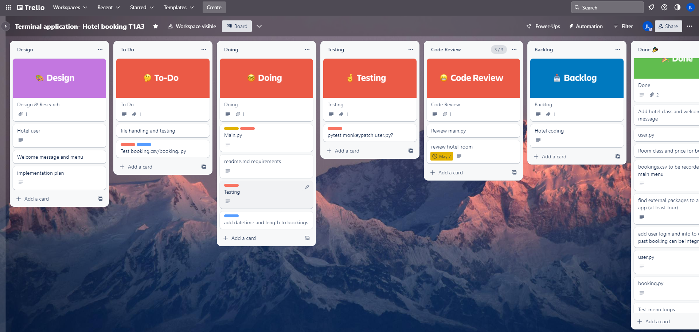
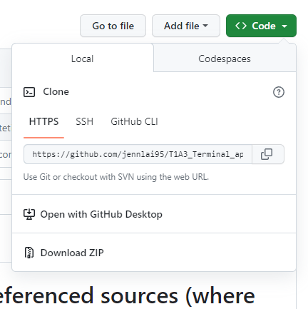

# Readme requirements  

# R3 Provide full attribution to referenced sources (where applicable).

# R4 Provide a link to your source control repository

Trello: https://trello.com/b/kLus5Ies/terminal-application-hotel-booking-t1a3
Github: https://github.com/jennlai95/T1A3_Terminal_application
Presentation video: https://youtu.be/4EV1Uu4wgZA

# Identify any code style guide or styling conventions that the application will adhere to.

Reference the chosen style guide appropriately.

Using the PEP8 style guide to write the code
Python enhancement proposals. (n.d.). Retrieved May 3, 2023, from https://peps.python.org/pep-0008/

# R6 Develop a list of features that will be included in the application. It must include:
- at least THREE features
- describe each feature

Note: Ensure that your features above allow you to demonstrate your understanding of the following language elements and concepts:
- use of variables and the concept of variable scope
- loops and conditional control structures
- error handling

Consult with your educator to check your features are sufficient .

# About 

This is a hotel booking system application that allows clients/users to view available rooms and make a booking. It also lets users check for previous bookings. Each futures uses error handling, loops and variables 

#features
## Menu 
The first feature is the main menu that displays all the available features and functions of the program. This allows them to select their choices or to exit the program. The menu uses error handling and if and elif statements. 
Below is the discord discussion for this application.

## View and enter current user
This inputs the current user so it can be saved. This has a defined user function and also saves the input to user.csv

## View available rooms and process 
This allows users to view the current available rooms and prices, it will also prompt the users if they want to make a booking or if they want to continue browsing

## Booking 
This allows the users to make a booking and choose the length of their stay. It saves user choices and inputs to bookings.csv for file handling and can be recalled in the following booking records features. 

## Booking records
This provides a list of the previously made bookings and the user who made the booking. This recalls the bookings.csv and also writes the records in rows for readability in the program

## Exit 
exits program. 

# R7 Develop an implementation plan

I used trello to outline all the features, what needed to be prioritised and what is done. In the review section I added coding that was done but should be reviewed when there is time so I can add further features. The different coloured labels also indicates the priorities and what section it is in. The orange label for example is important and needs to be completed soon.

Day 1: Trello management

Day 3: Trello 

> Your checklists for each feature should have at least 5 items.
# R8. Design help documentation which includes a set of instructions which accurately describe how to use and install the application.

## Usage
System requirements
User will need to used windows 10/11 to run the files and requires an internet connection and browser to download the file needed.
This program is best run on VSCODE on Windows which can be installed from here : https://code.visualstudio.com/download

### Python 

User will also need a zip file reader to extract the downloaded zip folder.
You can install the Python extension on VSCODE by going to Visual studio Marketplace. To use this program you will need to have python3 installed : https://code.visualstudio.com/docs/python/python-tutorial

You can check the python version by going to Terminal in VSCODE and typing: 
python3 -- version

### Install Application 

To install this application, you will need to clone or download this repo. 

*Downloading 
To download a GitHub repository: 
1. Navigate to the main page of the repository:  https://github.com/jennlai95/T1A3_Terminal_application
2. Click on <> Code
3. Download Zip
4. Once downloaded, extract the zip folder and open on VSCode 
5. Once opened you can run the run.sh file in bash terminal
    Select view > New terminal and from there choose bash
    in bash type ./run.sh to run the program, wait for the program to install the necesary packages and you're good to go!

Alternatively you can double click the run.sh file to run the program from the downloaded folder. 

<!-- R9	An overview of your Terminal application	The main features and overall structure of your app
R10	An overview of your code	An explanation of the important parts of your code, including any crucial application logic -->

<!-- # R11 Implement features in the software development plan you have designed. You must utilise a range of programming concepts and structures using Python such as:
** - variables and variable scope
- loops and conditional control structures
- write and utilise simple functions
- error handling
- input and output
- importing a Python package
- using functions from a Python package**

# R12 Apply DRY (Don’t Repeat Yourself) coding principles to all code produced.

# R13 Apply all style and conventions for the programming language consistently to all code produced.

# R14 Creates an application which runs without error and has features that are consistent with the development plan. -->
# Packages used
Internal and external packages used are
- csv
- style
- colored
- pytest 
- unittest
- datetime

# R15 Design TWO tests which check that the application is running as expected.

Each test should:
- cover a different feature of the application
- state what is being tested
- provide at least TWO test cases and the expected results for each test case

> An outline of the testing procedure and cases should be included with the source code of the application

Tested the application using Pytest and Monkeypatch to create a mock function to assert the results. This is in test_user.py
The user test uses a mock input and asserts that if the input is put into the get_user() function it will give the expected result. 

I also used unittest to assert the expect result for main menu when choosing to exit (choosing choice 5). It asserts that when choice 5 is chosen from the main menu then it will exit the program entirely. As seen below both tests passed

# R16 	Utilise source control throughout the development of the application by:
- making regular commits (at least 20 commits) with a commit message that summarises the changes
- pushing all commits to a remote repository

# R17 Utilise developer tools to facilitate the execution of the application:
<!-- For example,
- writing a script which turns the application into an executable -->

run.sh program can be used to execute the program

sources

https://docs.python.org/3/library/unittest.html
https://peps.python.org/pep-0008/
